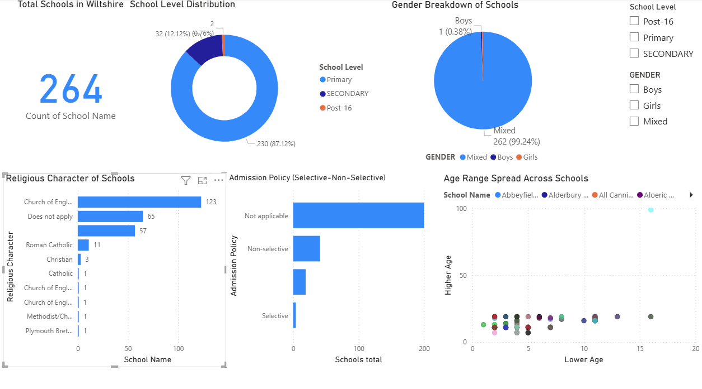

# 📊 Wiltshire Schools Analytics Dashboard

An end-to-end data analytics project exploring school performance in Wiltshire using Python and Power BI.

## 📌 Objectives
- Demonstrate ETL and visualization skills
- Build recruiter-ready portfolio content
- Practice dashboard interactivity and layout polish

## 📊 Dashboard Features
- Total number of schools
- School level distribution (Primary, Secondary, Post-16)
- Gender breakdown
- Religious character analysis
- Admission policy overview
- Age range scatter plot with interactive filters

## 🛠️ Tech Stack
- Python (pandas) for data cleaning
- Power BI for dashboarding
- GitHub for version control

## 📁 Project Files
- `school_data.csv` → raw dataset  
- `school_cleaned.csv` → cleaned dataset  
- `Schools.ipynb` → data cleaning notebook  
- `school_cl.pbix` → Power BI dashboard  
- `assets/Dashboard.png` → dashboard screenshot used in README   

## 📷 Preview

## 💼 Author
**Zaher Aziza** — aspiring AWS Data Engineer focused on public sector analytics and cloud ETL pipelines.
